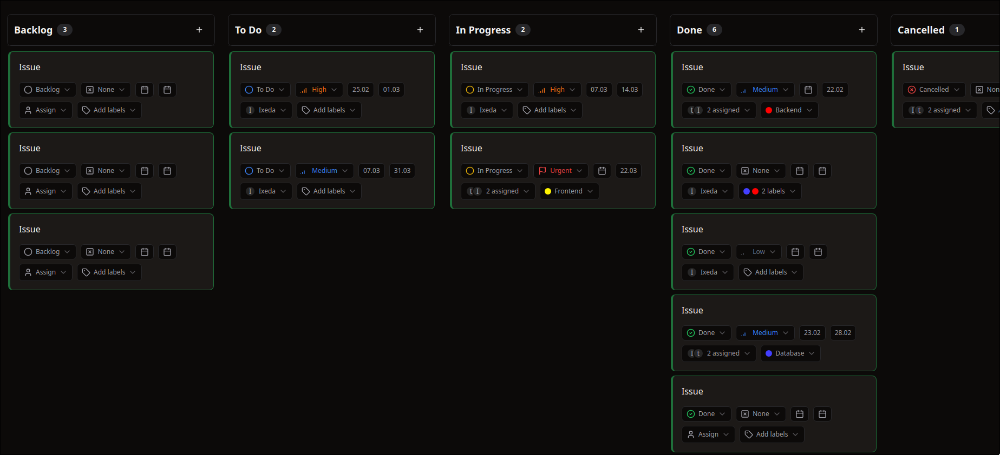

<div align="center">

# Teamix Frontend

<a href="https://github.com/ixedasan/teamix-backend" target="_blank">
    
</a>

<br />

</div>

TEAMIX is a comprehensive team collaboration platform designed to enhance productivity and streamline project management. It offers a feature-rich environment for task management, document collaboration, and team communication.



<div align="center">
  
</div>

## 🚀 Features

- **Project Management**

  - Create and manage multiple projects
  - Assign team members with different roles
  - Track project progress and analytics

- **Task Management**

  - Kanban board view for visual task management
  - Table view for detailed task lists
  - Task prioritization, labeling, and status tracking
  - Task assignments and deadlines

- **Document Collaboration**

  - Real-time document editing
  - Rich text formatting with TipTap editor
  - Document organization within projects
  - Attachment support

- **Team Collaboration**

  - Member invitations and role management
  - Comment threads on tasks
  - Activity tracking
  - Notification system

- **Analytics & Reporting**

  - Project and task analytics
  - Team performance metrics
  - Timeline visualization
  - Status and priority distribution charts

- **User Management**

  - Profile customization
  - Two-factor authentication (TOTP)
  - Session management
  - Social links

- **Customization**
  - Theme switching (light/dark)
  - Color scheme selection
  - Multiple language support

## 🛠️ Tech Stack

- **Frontend**: Next.js, React, TypeScript
- **Styling**: TailwindCSS
- **State Management**: Zustand
- **Forms**: React Hook Form, Zod
- **Data Fetching**: Apollo Client (GraphQL)
- **UI Components**: Shadcn
- **Charts & Visualization**: Recharts
- **Text Editor**: TipTap
- **Internationalization**: next-intl

## 📋 Prerequisites

- Node.js (v20+)
- Bun

## 🚀 Getting Started

To clone and run this application, you'll need [Git](https://git-scm.com/) and [Bun](https://bun.sh/) installed on your computer. From your command line:

```bash
# Clone this repository
$ git clone https://github.com/ixedasan/teamix-frontend.git

# Navigate to the project directory
$ cd teamix-frontend

# Install dependencies
$ bun install

# Set up environment variables
$ cp .env.example .env

# Start the development server
$ bun dev
```

## 🏗️ Project Structure

```
├── app/                  # Next.js app router
│   ├── account/          # Auth-related pages
│   ├── (landing)/        # Landing page
│   ├── (main)/           # Main application pages
│   │   ├── dashboard/    # Dashboard
│   │   ├── projects/     # Projects management
│   │   ├── profile/      # User profile
│   │   └── settings/     # User settings
├── components/           # React components
│   ├── common/           # Shared components
│   ├── features/         # Feature-specific components
│   ├── layout/           # Layout components
│   └── ui/               # UI components
├── graphql/              # GraphQL operations and generated code
│   ├── fragment/         # GraphQL fragments
│   ├── mutations/        # GraphQL mutations
│   ├── queries/          # GraphQL queries
│   └── subscriptions/    # GraphQL subscriptions
├── hooks/                # Custom React hooks
├── lib/                  # Utility libraries
├── providers/            # Technology providers
├── schemas/              # Zod validation schemas
├── store/                # Zustand stores
└── utils/                # Utility functions
```

## 🔄 Available Scripts

- `bun dev` - Start the development server
- `bun build` - Build the application for production
- `bun start` - Start the production server
- `bun lint` - Run ESLint
- `bun codegen` - Generate TypeScript types from GraphQL schema

## 🌐 Internationalization

The application supports multiple languages:

- English (en)
- Ukrainian (ua)

Language files are located in the `public/languages` directory.

## 🤝 Contributing

Contributions are welcome! Please feel free to submit a pull request or open an issue for discussion.
